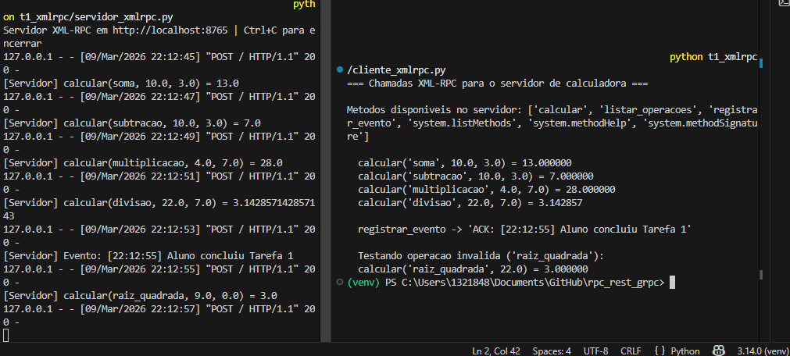
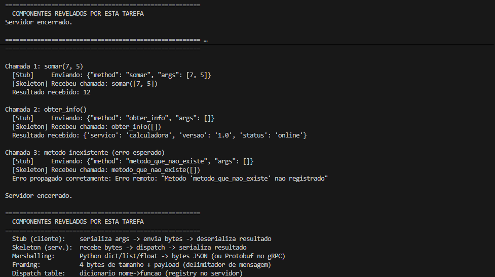
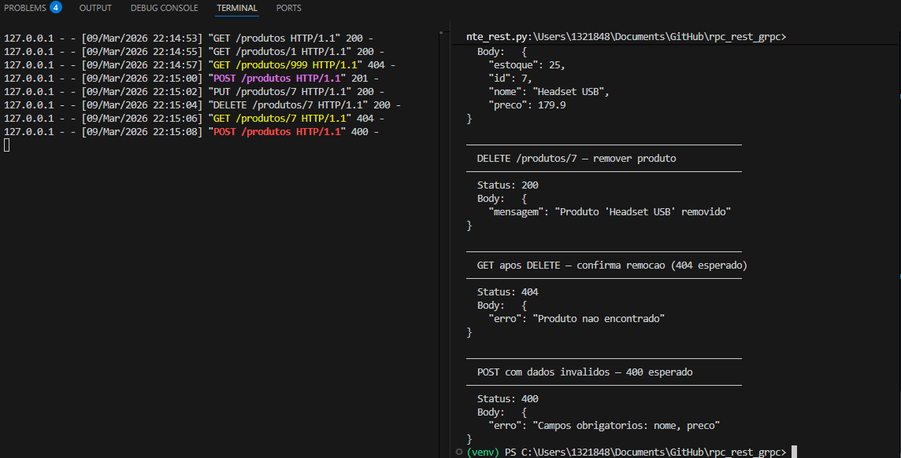
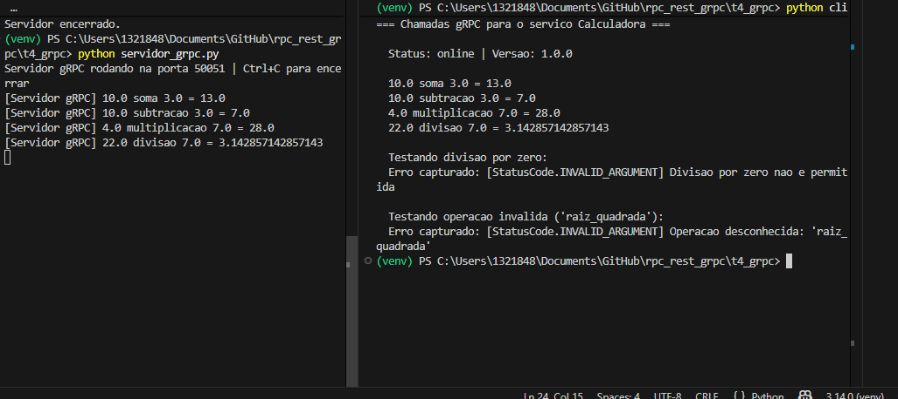
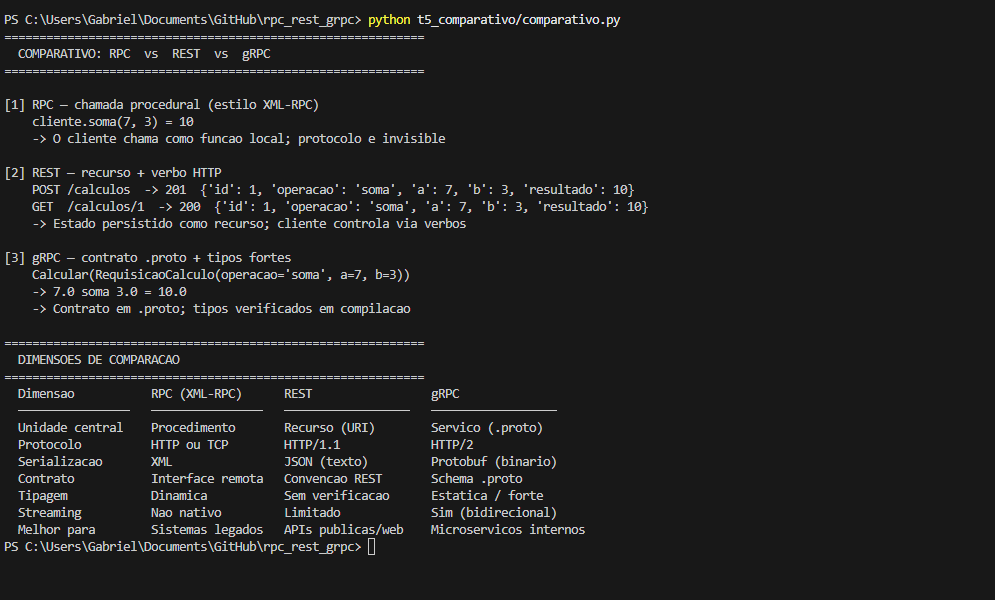

# Lab 05 — Comunicação entre Processos: RPC, REST e gRPC na Prática
**Nome:** Gabriel Pimentel Tabatinga

## Evidências de Execução no Console

Abaixo estão os registros das execuções de cada uma das tarefas propostas no laboratório.

### Tarefa 1: XML-RPC
*(Comunicação transparente através de métodos locais e propagação de erros)*

### Tarefa 2: Stub Manual
*(Expondo o processo de Marshalling, Framing e Unmarshalling com Sockets TCP)*

### Tarefa 3: REST com Flask
*(Manipulação de recursos através de URIs e métodos HTTP padronizados)*

### Tarefa 4: gRPC
*(Geração de stubs via Protobuf e comunicação estruturada sobre HTTP/2)*

### Tarefa 5: Comparativo entre Paradigmas
*(Análise comparativa gerada pelo script)*

---

## Bloco de Reflexão

**1. Stubs e skeletons:** Explique, com base no que você observou na Tarefa 2, o papel do stub (cliente) e do skeleton (servidor) em qualquer sistema RPC. Por que esses componentes existem — o que aconteceria sem eles?

**Resposta:** O *stub* atua como um proxy local que realiza o *marshalling* (serialização) dos argumentos e os envia via rede. O *skeleton* recebe os bytes, faz o *unmarshalling* (deserialização) e despacha a chamada para a função real no servidor. Eles provêm "transparência de invocação" em sistemas distribuídos. Sem eles, o desenvolvedor teria que gerenciar manualmente os sockets, o empacotamento binário e a conversão de tipos em toda comunicação de rede, perdendo o foco na regra de negócio.

**2. REST não é RPC:** Fielding (2000) critica explicitamente o uso de RPC sobre HTTP por violar a restrição de interface uniforme do REST. Com base nas Tarefas 1 e 3, descreva uma diferença fundamental de modelagem entre as duas abordagens, usando um exemplo concreto da sua implementação.

**Resposta:** A diferença central é que o RPC é orientado a ações, enquanto o REST é orientado a recursos (substantivos). Na Tarefa 1, o cliente chama uma função explícita no servidor, como `proxy.calcular("soma", 10, 3)`. Na Tarefa 3, o estado do recurso é manipulado através de verbos HTTP padronizados; por exemplo, enviamos um payload com `POST /produtos` para criar um item, recebendo um status semântico como `201 Created` sem invocar funções pelo nome.

**3. Evolução de contrato:** O `.proto` da Tarefa 4 define o campo `resultado` como `double`. Se você precisasse adicionar um novo campo `unidade: string` ao `RespostaCalculo` sem quebrar clientes existentes, como o Protobuf lida com isso? E como o REST (sem schema) lidaria com a mesma mudança?

**Resposta:** O gRPC lida com a evolução de forma retrocompatível através de tags numéricas no `.proto` (ex: `string unidade = 3;`). Clientes desatualizados simplesmente ignoram o novo campo durante o *unmarshalling* binário. No REST, que utiliza JSON *schemaless*, a adição também não quebra clientes antigos, pois parsers JSON toleram chaves extras. Contudo, o REST perde a validação estática e a garantia de tipagem forte oferecida pelo compilador do Protobuf.

**4. Escolha de tecnologia:** Considere o seguinte cenário: uma startup precisa expor uma API de pagamentos tanto para parceiros externos (apps de terceiros) quanto para comunicação interna entre 10 microsserviços. Que tecnologia você recomendaria para cada caso e por quê? Baseie-se nos critérios do comparativo da Tarefa 5.

**Resposta:** Para a API externa, recomendo **REST**, pois usa JSON e HTTP, garantindo alta interoperabilidade universal sem exigir que os parceiros recompilem contratos específicos. Para a comunicação interna entre microsserviços, recomendo **gRPC**. Ele opera sobre HTTP com serialização binária (Protobuf), reduzindo muito a latência, e oferece **tipagem forte**, o que minimiza bugs de integração entre as equipes garantindo contratos estritos.

**5. Conexão com Labs anteriores:** O Lab 04 mostrou que transparência excessiva pode ser prejudicial. Como isso se aplica ao RPC? Em que situação a transparência do RPC — que faz uma chamada remota parecer local — pode levar um desenvolvedor a tomar uma decisão de design errada?

**Resposta:** A transparência excessiva do RPC oculta a complexidade e as falhas da rede sob a ilusão de uma chamada de função inofensiva. Isso induz o desenvolvedor a ignorar o impacto do *round-trip time* e o risco de timeouts. Sem perceber o custo da rede, ele pode cometer o erro clássico de iterar chamadas remotas em um loop (ex: `for id in lista: proxy.buscar(id)`) em vez de projetar uma comunicação em lote (*batch*) mais eficiente.
